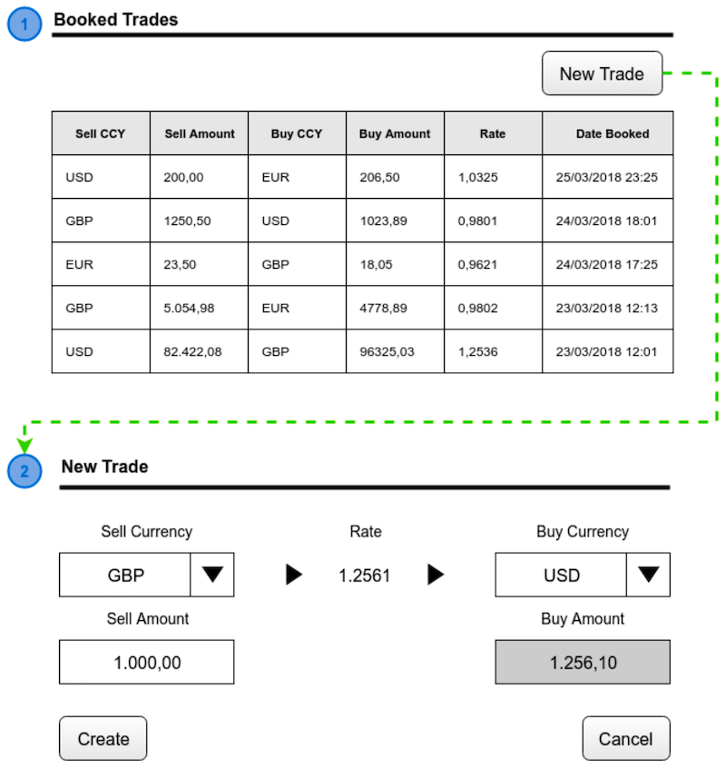

# Requisitos

En este taller vamos a construir una aplicación que nos permitirá crear y almacenar contratos de FX (intercambio de divisas).

**REQ1** - La principal vista es la Ebury Trading app, la cual contiene una lista mostrando los contratos previamente reservados y
algunos campos relevantes: Sell Currency, Sell Amount, Buy Currency, Buy Amount y Rate.

**REQ2** - Desde la vista principal podremos acceder, usando el botón de New Trade, a una nueva vista que nos permitirá reservar un contrato nuevo.
Solo Sell Currency, Sell Amount y Buy Currency serán editables, y el resto de campos se autocompletarán según REQ3.

**REQ3** - Usaremos un third party, en este caso fixer.io, para consultar rates en tiempo real a través de su API.



# Pasos
Los siguientes pasos estarán en inglés, ya que la recomendación es trabajar con Salesforce siempre en Inglés para acostumbraros a entornos internacionales.

## Paso 1 - Crear objecto y campos
Setup > Objects and fields > Picklist Value Sets > New
- Label: Currencies
- Description: List of currencies
- Values (separados por líneas, no espacios): EUR USD GBP

Setup > Object Manager > Create > Custom Object
- Label: Trade
- Plural: Trades
- Record Name: Trade Number
- Display format: TR{00000}
- Starting Number: 0

Trade > Fields & relationships > New
- Type: Number
- Field Label: Buy Amount
- Length: 16
- Decimal places: 2
- Description: Amount of the buy currency the customers wants to buy
- Profiles: by default
- Layouts: by default

Trade > Fields & relationships > New
- Type: Number
- Field Label: Sell Amount
- Length: 16
- Decimal places: 2
- Description: Amount of the sell currency the customers wants to sell
- Profiles: by default
- Layouts: by default

Trade > Fields & relationships > New
- Type: Picklist
- Field Label: Buy Currency
- Use global picklist value set: Currencies
- Description: Currency the customer wants to buy
- Profiles: by default
- Layouts: by default

Trade > Fields & relationships > New
- Type: Picklist
- Field Label: Sell Currency
- Use global picklist value set: Currencies
- Description: Currency the customer wants to sell
- Profiles: by default
- Layouts: by default

Trade > Fields & relationships > New
- Type: Number
- Field Label: Rate
- Length: 14
- Decimal places: 4
- Description: Conversion rate from sell currency into buy currency
- Profiles: by default
- Layouts: by default

## Paso 2 - Crear vista y primera prueba

Setup > User Interface > Tabs > Custom Object Tabs > New
- Object: Trade
- Tab style: a gusto
- Profiles: by default
- Apps: by default

Setup > Apps > App Manager > New Lightning App
- App Name: Ebury Trading
- Description: Trading app supported by an external third party
- App options: by default
- Utility items: by default
- Navigation Items: Trades
- User Profiles: System Administrator

# Paso 3 - Ordenar vista

Setup > Object Manager > Trade > Page Layouts > Trade Layout
- Marcar todos los campos como read-only
- Reordenar campos


Ebury Trading > Trades > Open All list view
- Select fields to display: Sell Currency, Sell Amount, Buy Currency, Buy Amount, Rate, Created Date

En este punto acabamos de completar el primer requisito y vamos a continuar, esta vez usando código, con los siguientes.

# Paso 4 - New Trade - frontal

Lo primero es reemplazar el botón por defecto para crear nuevos Trades por el nuestro customizable.

Developer Console > File > New > Lightning Component
- Name: newTrade

Reemplazamos el contenido por el código en [newTrade1.cmp](newTrade1.cmp)

Setup > User Interface > Tabs > Lightning Component Tabs > New
- Lightning Component: c:newTrade
- Tab Label: New Trade
- Tab Style: cualquiera
- Profiles: by default

Setup > Object Manager > Trade > Buttons, Links, and Actions > New Button or Link
- Label: New Trade
- Display Type: List Button
- Behavior: Display in existing window without sidebar or header
- URL: /lightning/n/New_Trade


Setup > Object Manager > Trade > List View Button Layout > editamos el único layout que vemos aquí
- Eliminamos todos los botones standard
- Añadimos New Trade en la lista de Custom buttons

En este punto podemos comprobar que tenemos un nuevo botón y nos redirige al componente nuevo.

# Paso 5 - New Trade - añadiendo lógica

Developer Console > File > New > Apex Class
- Name: NewTradeController

Reemplazamos el contenido por el código en [NewTradeController.cls](NewTradeController.cls)

De vuelta en nuestro fichero newTrade.cmp, clickamos en controller y reemplazamos el contenido con el 
código en [newTradeController.js](newTradeController.js)

Finalmente, reemplazamos el código en newTrade.cmp por [newTrade2.cmp](newTrade2.cmp) el cual invoca los métodos 
añadidos al controlador.

En este punto acabamos de completar el segundo requisito y ya solo quedaría usar un servicio de rates en vez
de los rates aleatorios que estamos proporcionando actualmente.

# Paso 6 - proveedor de rates

Setup > Security > Remote Site Settings > New Remote Site
- Remote Site Name: fixerio
- Remote Site URL: https://api.apilayer.com

Developer Console > File > New > Apex Class
- Name: RatesProvider

Reemplazamos el contenido por el código en [RatesProvider.cls](RatesProvider.cls)

Para terminar, reemplazamos el calculo aleatorio del rate por la llamada al servicio recién creado:
```
trade.Rate__c = RatesProvider.getLatestRate(trade.Sell_Currency__c, trade.Buy_Currency__c);
```

Ya podemos comprobar como nuestra implementación satisface, de manera muy simple, todos los requisitos mencionados inicialmente.

_Advertencia: el código usado es este taller está extremadamente simplificado por motivos didácticos y no debe ser tomado como ejemplo
de buenas prácticas en ningún caso._